# R&T BiCMOS Run 2

<div align="left">
  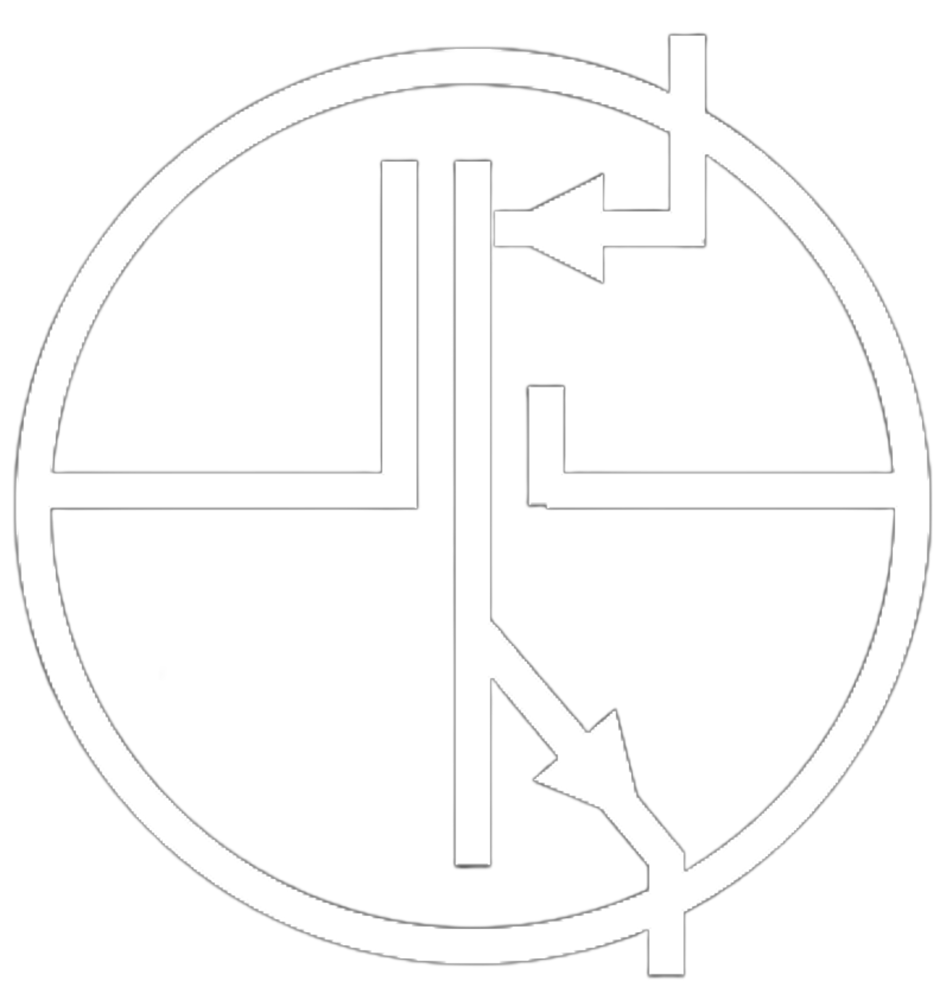
</div>

Description: The development of this circuit is part of a broader R&D effort. With this specific LNA design, we aimed to optimize the performance of a low-noise amplifier intended for cryogenic operation (77 K). The optimization focused on reducing both white and flicker noise, mainly by adjusting the transistor dimensions and bias current. A low-frequency noise level down to $1 nV/ \sqrt{Hz}$ at frequencies as low as 1 Hz is targeted.
At the same time, the amplifier must cover a bandwidth greater than 20 MHz, provide a voltage gain of approximately 30 V/V, and feature both DC-coupled input and output stages. The thermal drift of the gain is also addressed by using a proportional-to-temperature current source ($ I_C \propto$ T) to compensate for the intrinsic inverse temperature dependence of the voltage gain ($\propto g_m=qIc/kT$).

 [A Data sheet view](main.pdf) 

## Schematic 

### Block diagram 
<div align="center">
  
</div>

### LNA Schematic 
<div align="center">
  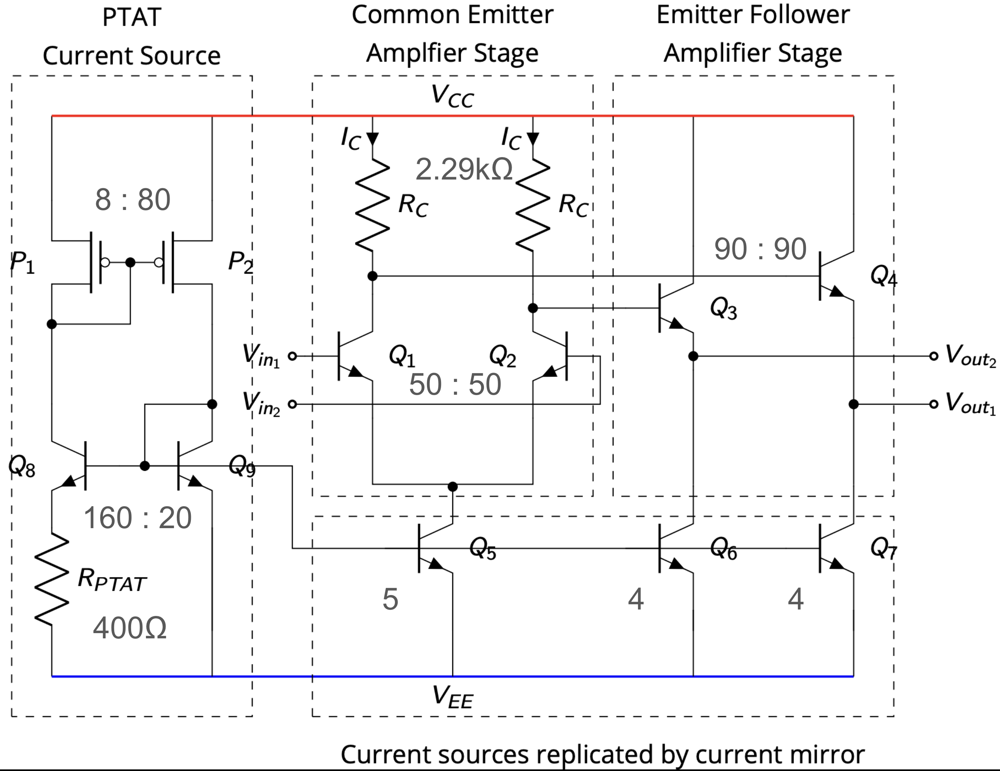
</div>

## Layout 
<div align="center">
  
</div>

Technology: IHP130 SG13S 

Die size (Length in µm x Wide in µm):   1264 μm × 913 μm 
## Data sheet 
The test's result bases on two approach:
* The comparison between the two LNA 
  * First LNA utilises on-chip resistor (huge central brown block and smaller block below).
  * Second LNA use the external resistor that will include later with the PCB design.
* The characteristic of the large NMOS 
### 1. Gain 

<table>
  <tr>
    <td> 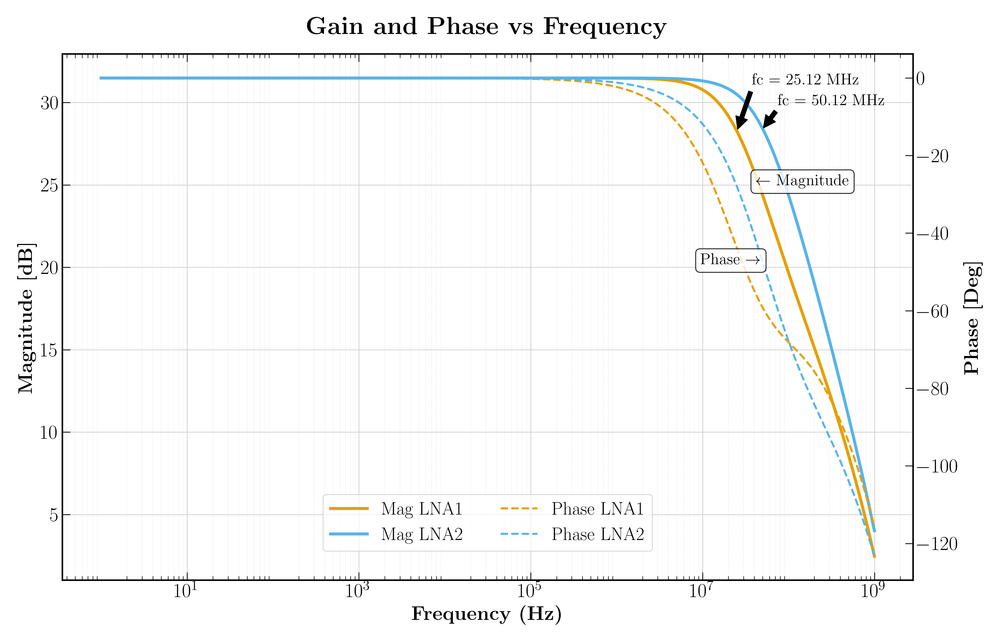</td>
    <td> 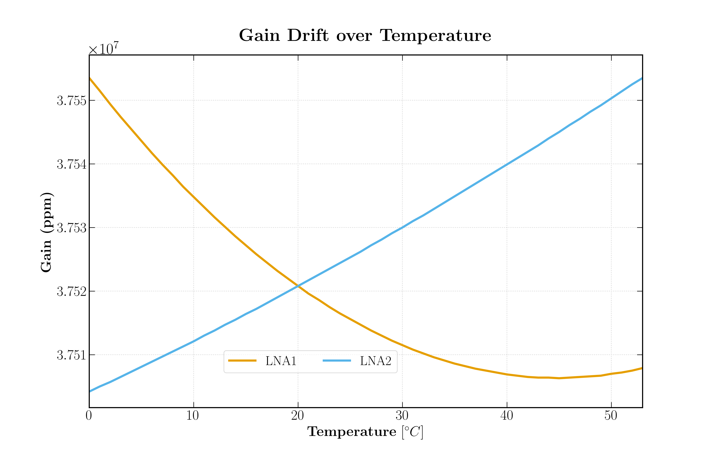</td>
  </tr>
</table>

### 2. Input referred Noise

<div align="left">
  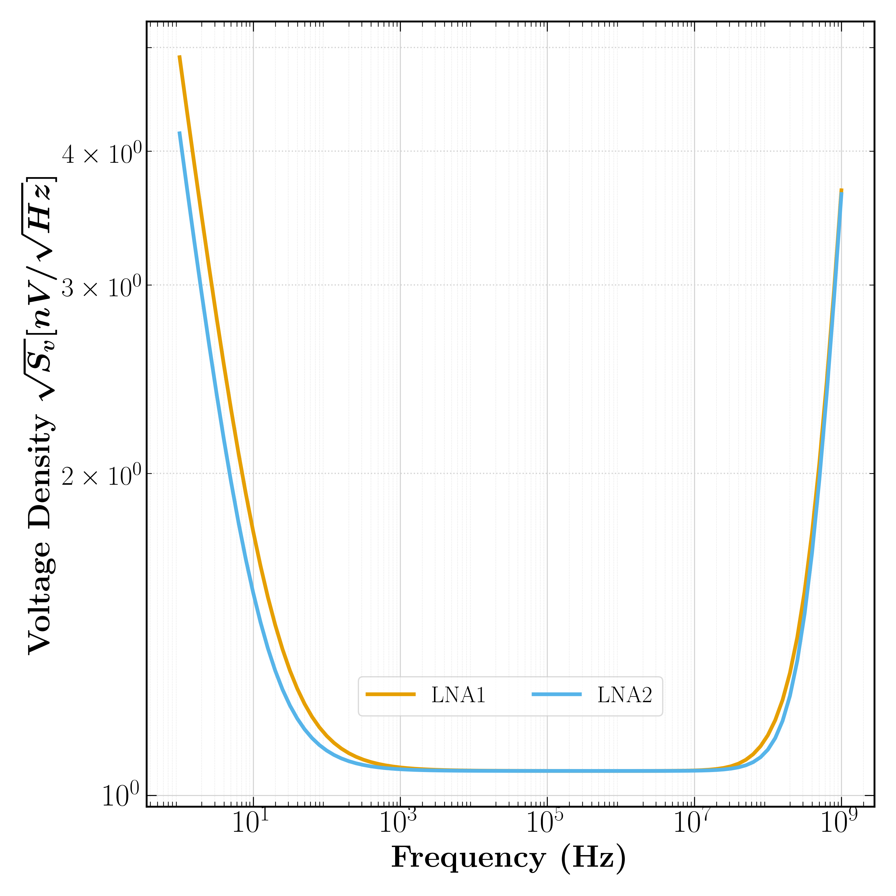
</div>

LNA 1: Temperature Comparison ($27^\circ\text{C}$ vs $45^\circ\text{C}$)

| Frequency | Vcm | Avg ($27^\circ\text{C}$) | Avg ($45^\circ\text{C}$) | Range ($27^\circ\text{C}$) | Range ($45^\circ\text{C}$) |
| :--- | :---: | :---: | :---: | :---: | :---: |
| **1 Hz** | -0.5V | 11.07 | 12.35 | 4.12 - 26.90 | 6.28 - 28.18 |
| | 0.0V | 11.09 | 12.37 | 4.16 - 26.96 | 6.28 - 28.24 |
| | 0.5V | 11.11 | 12.39 | 4.20 - 27.01 | 6.29 - 28.28 |
| **10 kHz** | -0.5V | 1.09 | 1.12 | 1.06 - 1.11 | 1.09 - 1.15 |
| | 0.0V | 1.08 | 1.12 | 1.06 - 1.11 | 1.09 - 1.14 |
| | 0.5V | 1.08 | 1.11 | 1.06 - 1.11 | 1.09 - 1.14 |
| **100 kHz** | -0.5V | 1.08 | 1.12 | 1.06 - 1.11 | 1.09 - 1.14 |
| | 0.0V | 1.08 | 1.11 | 1.06 - 1.11 | 1.09 - 1.14 |
| | 0.5V | 1.08 | 1.11 | 1.05 - 1.11 | 1.09 - 1.14 |

***

LNA 2: Temperature Comparison ($27^\circ\text{C}$ vs $45^\circ\text{C}$)

| Frequency | Vcm | Avg ($27^\circ\text{C}$) | Avg ($45^\circ\text{C}$) | Range ($27^\circ\text{C}$) | Range ($45^\circ\text{C}$) |
| :--- | :---: | :---: | :---: | :---: | :---: |
| **1 Hz** | -0.5V | 11.29 | 12.23 | 4.24 - 25.37 | 5.11 - 26.58 |
| | 0.0V | 11.31 | 12.26 | 4.24 - 25.43 | 5.11 - 26.64 |
| | 0.5V | 11.33 | 12.28 | 4.25 - 25.48 | 5.12 - 26.69 |
| **10 kHz** | -0.5V | 1.09 | 1.12 | 1.07 - 1.10 | 1.10 - 1.14 |
| | 0.0V | 1.08 | 1.11 | 1.06 - 1.10 | 1.10 - 1.13 |
| | 0.5V | 1.08 | 1.11 | 1.06 - 1.10 | 1.09 - 1.13 |
| **100 kHz** | -0.5V | 1.08 | 1.12 | 1.07 - 1.10 | 1.10 - 1.13 |
| | 0.0V | 1.08 | 1.11 | 1.06 - 1.10 | 1.09 - 1.13 |
| | 0.5V | 1.08 | 1.11 | 1.06 - 1.10 | 1.09 - 1.13 |

*Note: All noise values are in nV.*

### 3. Signal Response 

Simulation done by using a ```Vpulse``` with $t_{delay} = 0.5 \mu s$, $period = 2 \mu s$ and $PW = 1 \mu s$ at the input of the amplifier

<table>
  <tr>
    <td> 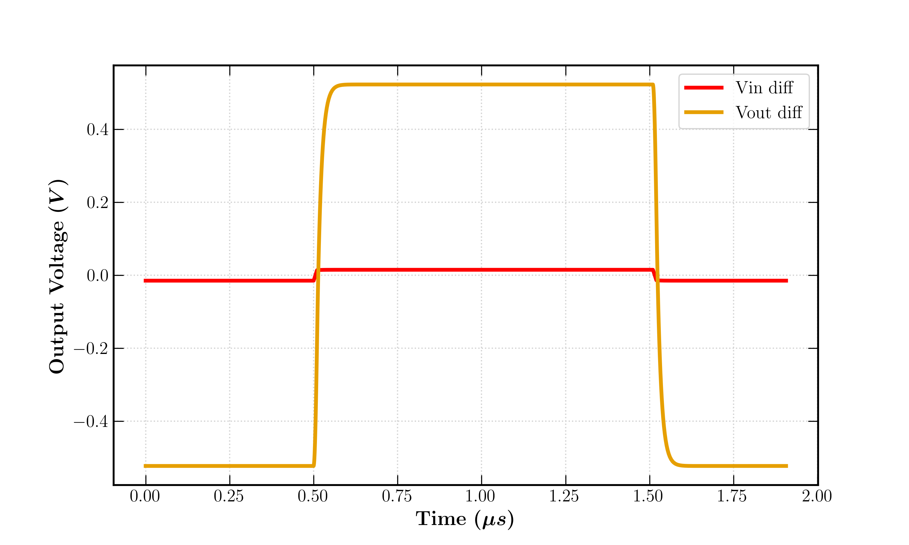</td>
    <td> 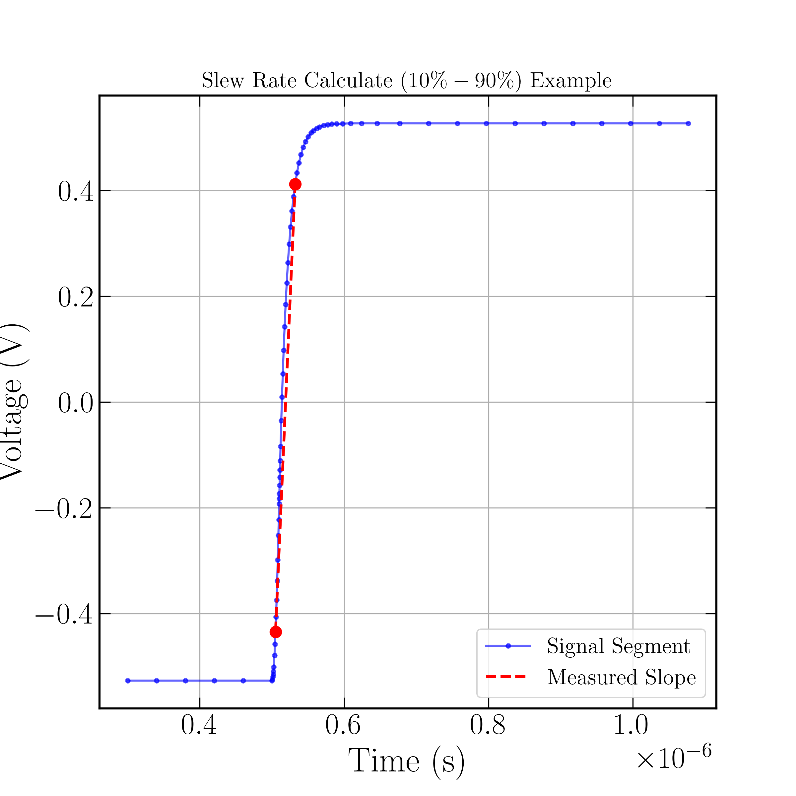</td>
  </tr>
</table>

Calculated results for ```rise time``` and ```slew rate```

<table>
  <tr>
    <td> 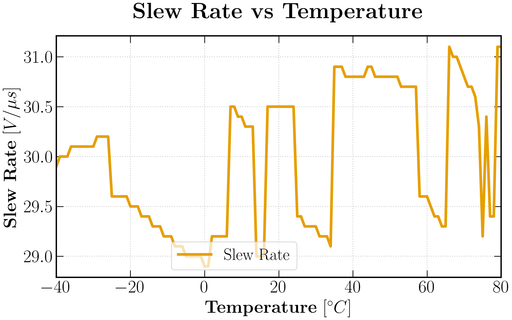</td>
    <td> 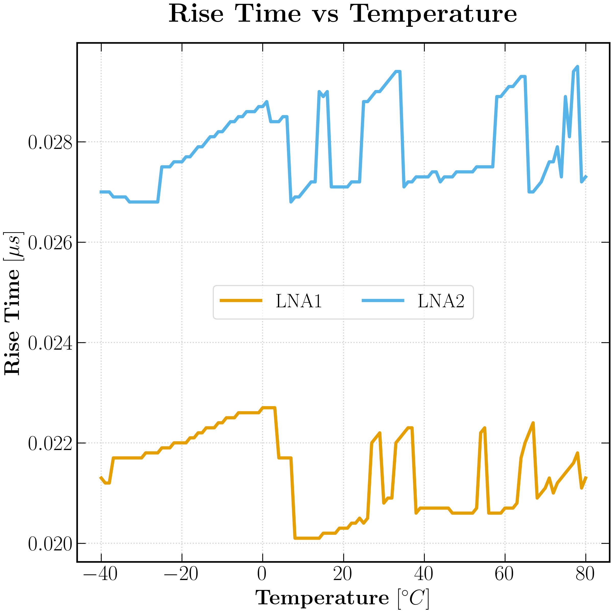</td>
  </tr>
</table>

With the histogram represent distribution of slew rate at $27^{\circ}C$ and $45^{\circ}C$

<div align="left">
  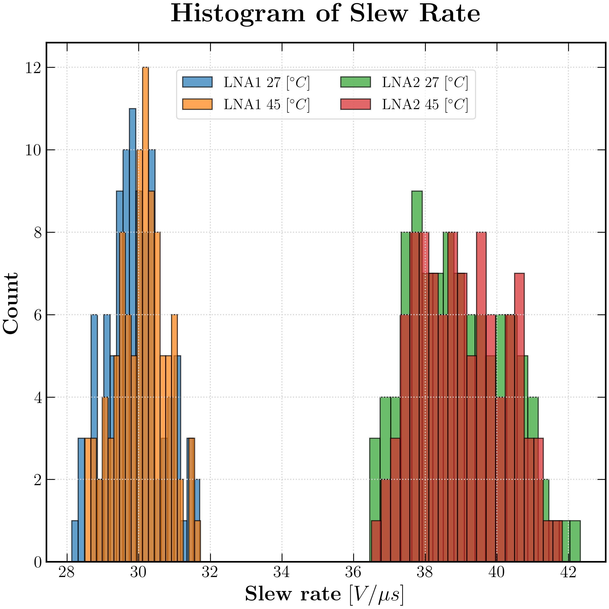
</div>

### 4. Common-mode Rejection Ratio (CMRR)
<table>
  <tr>
    <td> 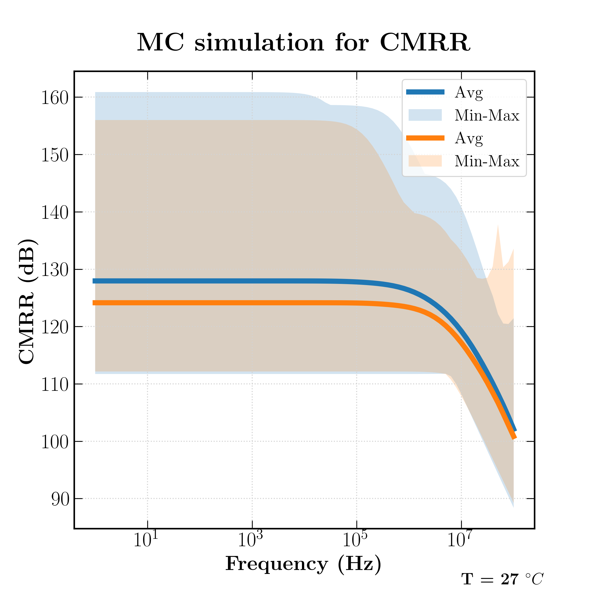</td>
    <td> 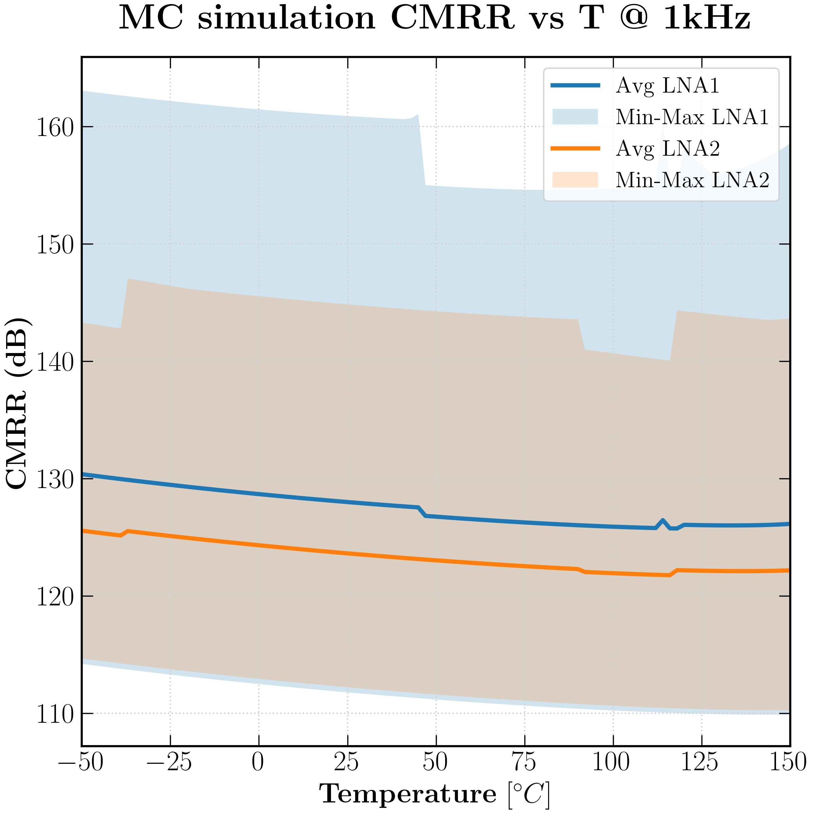</td>
  </tr>
</table>


### 5. Power Supply Rejection Ratio 

Here we show the PSRR of VCC and VEE source for LNA1 and LNA2 

<table>
  <tr>
    <td> 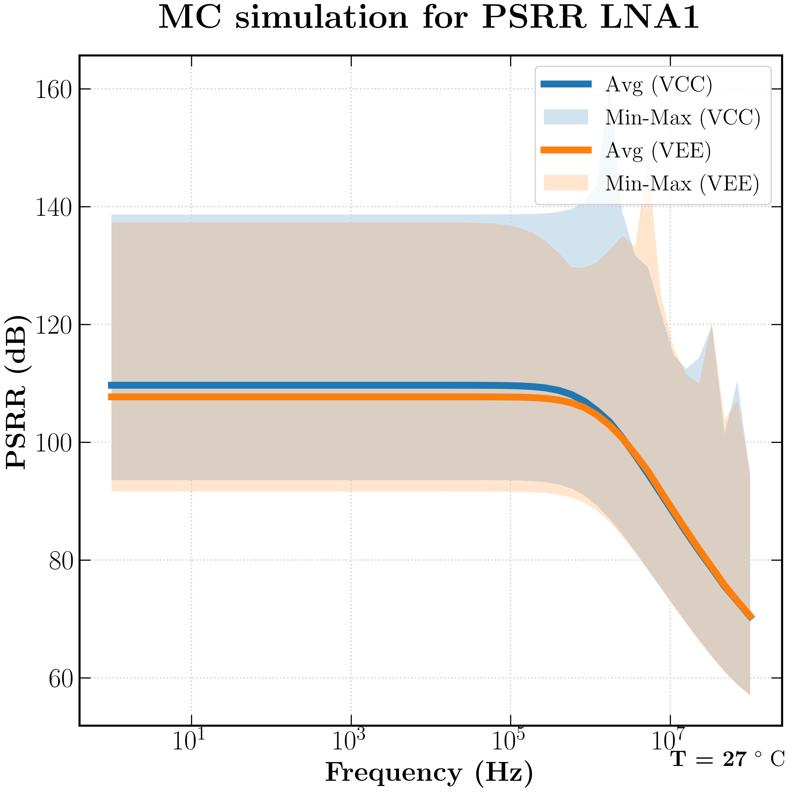</td>
    <td> 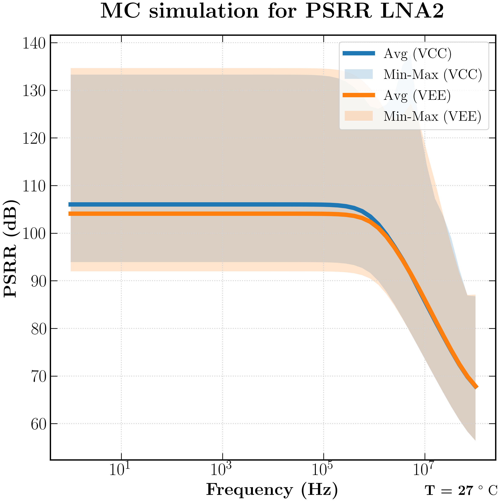</td>
  </tr>
</table>


<table>
  <tr>
    <td> 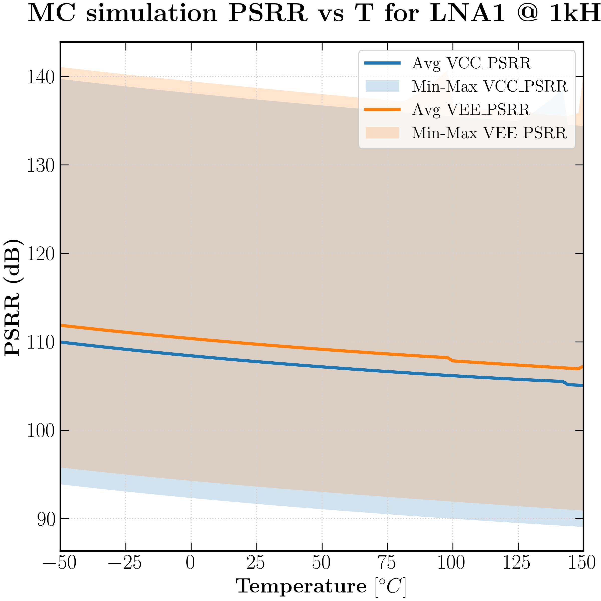</td>
    <td> 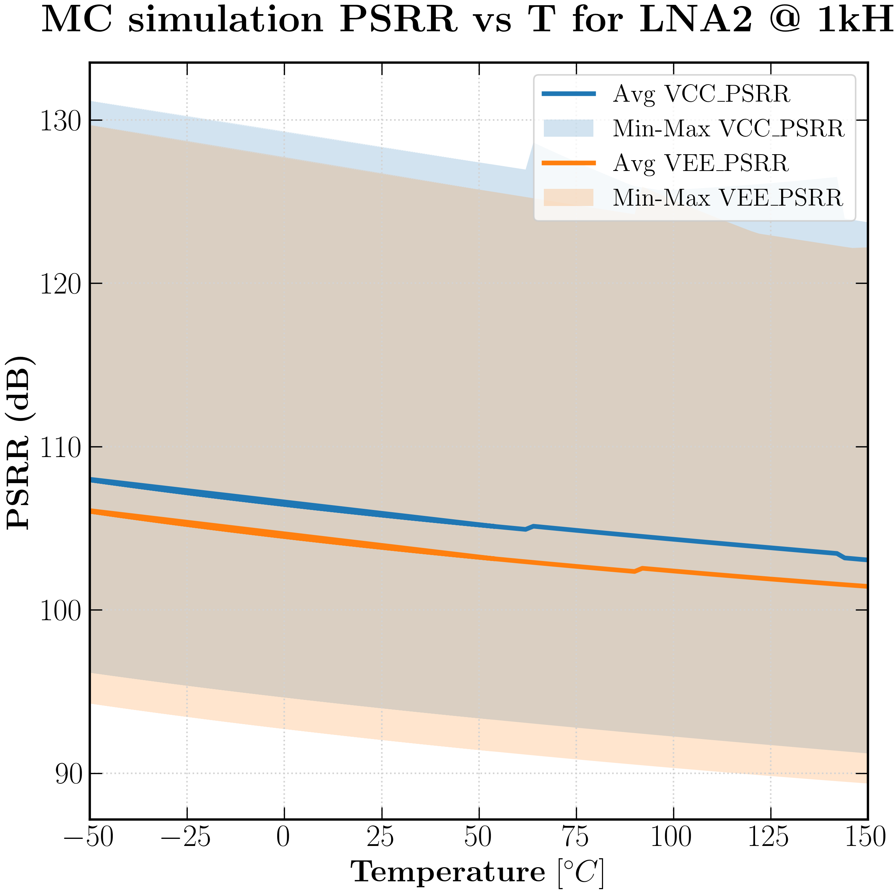</td>
  </tr>
</table>


## Packaging 
For packaging this ASIC, we are going to use the QFN24 
<div align="center">
  
</div>


